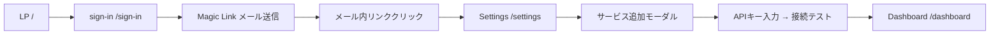

# フロー: オンボーディング

サインアップから最初のコストが表示されるまでの一連の流れ。
UX原則「5分でセットアップ完了」の達成度を測る基準フローとして使う。

## 前提条件

- 未認証のユーザーがLPを訪問した状態
- アカウント未作成（初回サインアップ）

## ステップ

1. **LP** (`/`) — 「無料で始める」ボタンをクリック
2. **サインイン** (`/sign-in`) — メールアドレスを入力 → Magic Link 送信
3. **メール確認** — 受信したMagic Linkをクリック
4. **Settings** (`/settings`) — Clerk認証完了後にリダイレクト（`NEXT_PUBLIC_CLERK_AFTER_SIGN_IN_URL=/settings`）
   - 初回はコストアイテムが0件の空状態
5. **サービス追加** — 「サービスを追加」ボタン → スライドオーバー表示
   - サービス選択（AWS / Vercel / GCP / GitHub / Datadog / Anthropic / OpenAI / Resend / 請求書）
   - APIキー・クレデンシャル入力
   - 接続テスト（対応サービスのみ）
6. **保存** — アイテム作成 → スライドオーバー閉じる → Settingsに一覧表示
7. **Dashboard** (`/dashboard`) — サイドバーの「Dashboard」をクリック
   - 初回はコストキャッシュなし → APIコールが走り当月コストが表示される

## 分岐

**接続テスト成功時**
- 緑のチェックマークを表示して保存ボタンが活性化

**接続テスト失敗時**
- エラーメッセージをインライン表示（例: "Invalid API Key"）
- 保存はできない状態を維持

**コスト取得に時間がかかる場合**（AWS Cost Explorerなど）
- Dashboard側でローディングスピナーを表示
- タイムアウト時はエラー表示 + 「再試行」ボタン

## 所要時間の目標

| ステップ | 目標時間 |
|---|---|
| LP → Magic Link送信 | 1分以内 |
| メール受信 → Settings到達 | 30秒以内 |
| サービス追加（APIキー入力〜保存） | 2分以内 |
| Dashboard表示 | 30秒以内 |
| **合計** | **4分以内**（余裕を持って5分目標） |

## 未解決の課題・TODO

- [ ] 初回Settings表示時に「まずサービスを追加しましょう」の空状態ガイダンスが必要（現状: 何もない白い画面）
- [ ] Magic Linkのメール到達まで「メールを確認してください」の案内画面が必要
- [ ] Freeプランの3件上限に達したとき、追加ボタンをどう扱うか未定（無効化 or アップグレードモーダル）
- [ ] 組織アカウントでのサインアップフローが未定義（Clerk Organizationの作成タイミング）
