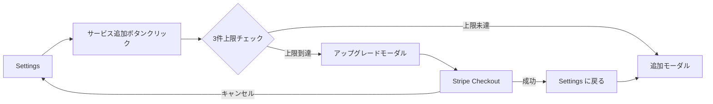
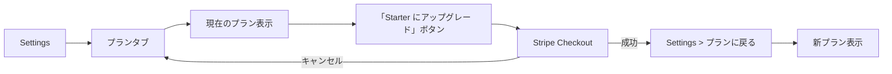

# フロー: アップグレード（Free → Starter / Growth）

Freeプランのユーザーが制限に達したとき、または自発的にアップグレードするときのフロー。
Stripe Checkout統合の実装issueを立てる前にこのフローを確定させ、手戻りを防ぐ。

## 前提条件

- Freeプランのユーザーがサインイン済み
- 以下のいずれかのシナリオで発生：
  - ① 連携サービスを4件目追加しようとした（3件上限）
  - ② 3ヶ月より古いコスト履歴を参照しようとした
  - ③ メール転送設定を開いた（Starter以上の機能）
  - ④ Settings > プラン画面から自発的にアップグレード

## トリガー別フロー

### シナリオ①: サービス追加上限（最も多いトリガー）

### シナリオ④: 自発的アップグレード（Settings > プラン）

## ステップ（Stripe Checkout）

1. **アップグレードモーダル / プラン画面** — Starter / Growth の機能比較と価格を表示
2. **プラン選択** — 「Starter ($49/月)」または「Growth ($149/月)」
3. **Stripe Checkout** (`/api/stripe/checkout-session` → `stripe.com`)
   - メールアドレスは Clerk から自動入力
   - 14日間無料トライアルの旨を表示
4. **決済完了** — Stripe Webhook → `/api/webhook/stripe` → プラン情報を DB に保存
5. **リダイレクト** — `STRIPE_SUCCESS_URL` 経由で Settings に戻る
6. **プラン反映** — Settings > プランに新しいプランが表示される

## 分岐

**決済成功時**
- Stripe Webhook が即座に届けばリダイレクト時点でプランが反映されている
- Webhook 遅延時: Settings 画面で「プランを更新中...」を表示して数秒後に再取得

**決済キャンセル時**
- `STRIPE_CANCEL_URL` 経由で元の画面に戻る（モーダル再表示 or プラン画面）

**カード決済エラー時**
- Stripe Checkout がインラインでエラーを表示（アプリ側での処理不要）

## Stripe 設定確認事項

| 項目 | 内容 |
|---|---|
| Starter Product ID | `prod_Uj7iZU8V4jL0sk`（$49/月、14日トライアル設定済み） |
| Growth Product ID | 未作成（$149/月、14日トライアル設定が必要） |
| Success URL | `/settings?checkout=success` 想定 |
| Cancel URL | `/settings?checkout=cancel` 想定 |
| Webhook エンドポイント | `/api/webhook/stripe` |
| Webhook イベント | `checkout.session.completed`, `customer.subscription.updated`, `customer.subscription.deleted` |

## 未解決の課題・TODO

- [ ] Stripe Checkout 統合の実装 issue 未作成（このフロー確定後に立てる）
- [ ] Growth プロダクトの Stripe 作成が必要
- [ ] アップグレードモーダルのデザイン未定（全画面モーダル vs インラインバナー）
- [ ] Webhook受信後のプラン情報をどこに保存するか未定（DynamoDB or Clerk metadata）
- [ ] ダウングレード・解約フローは未定義（Scale以外のセルフサービス解約を許可するか）
- [ ] Freeプランの連携3件上限チェックをどのAPIレイヤーで実施するか未定

## 関連

- `CLAUDE.md` — 収益モデル > Stripe設定・プラン一覧
- `docs/ux/decisions/001-free-plan-single-user.md`
- `docs/ux/flows/onboarding.md`
